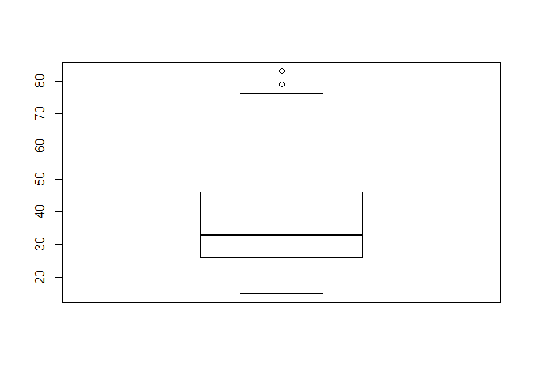
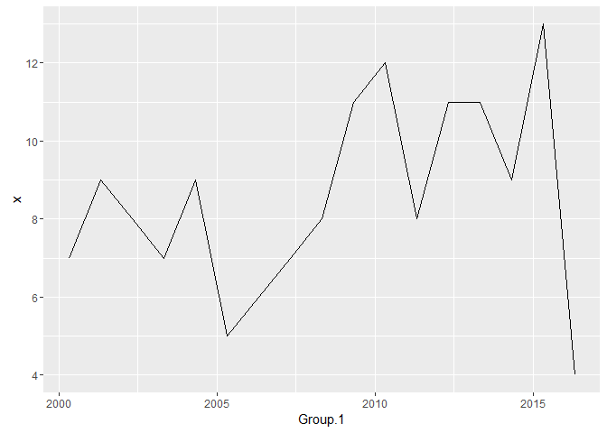
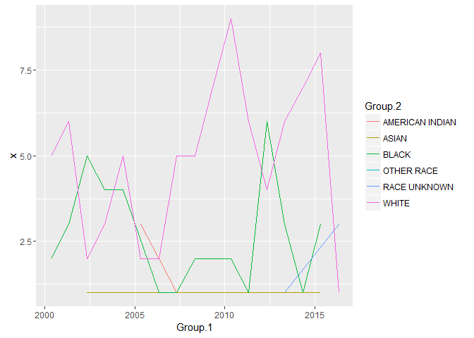
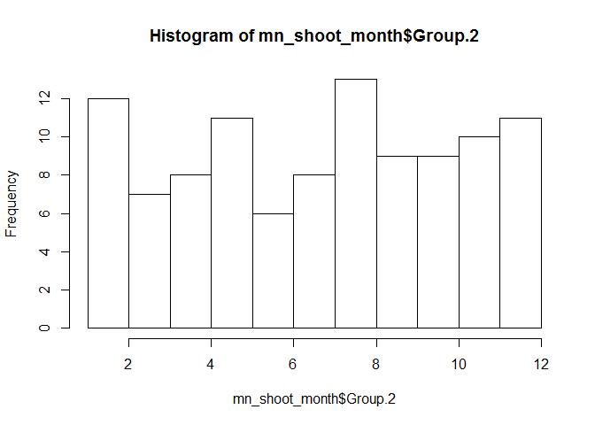
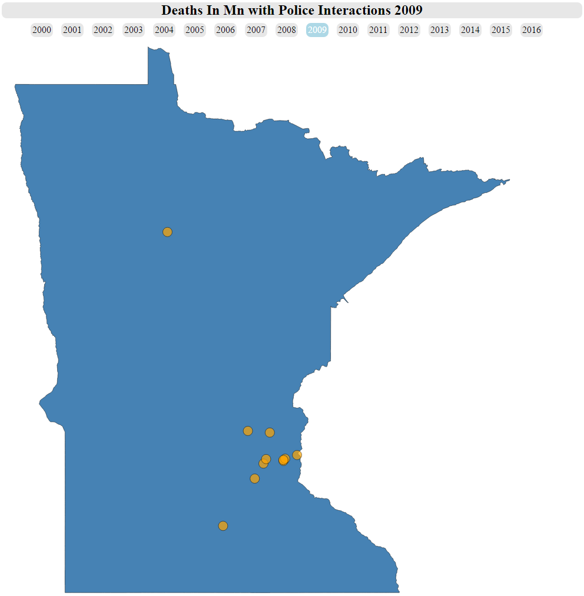
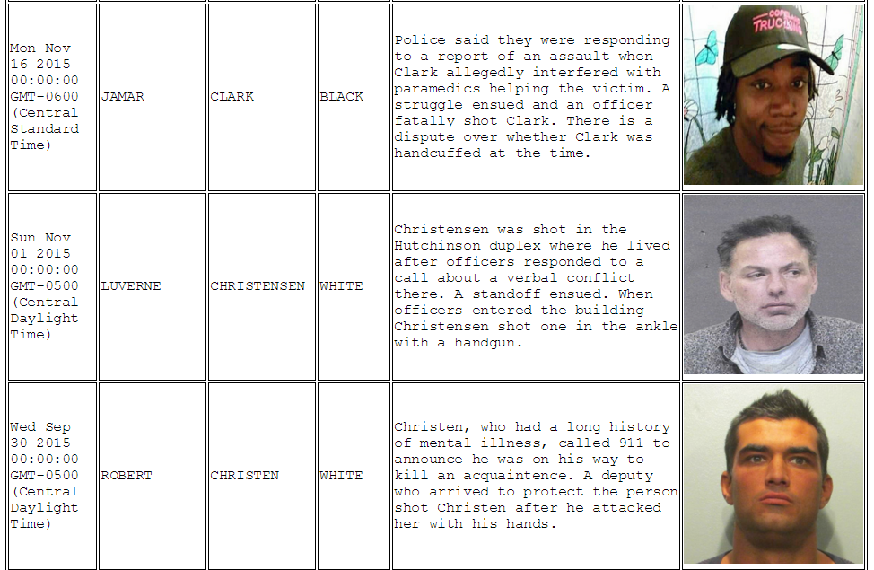
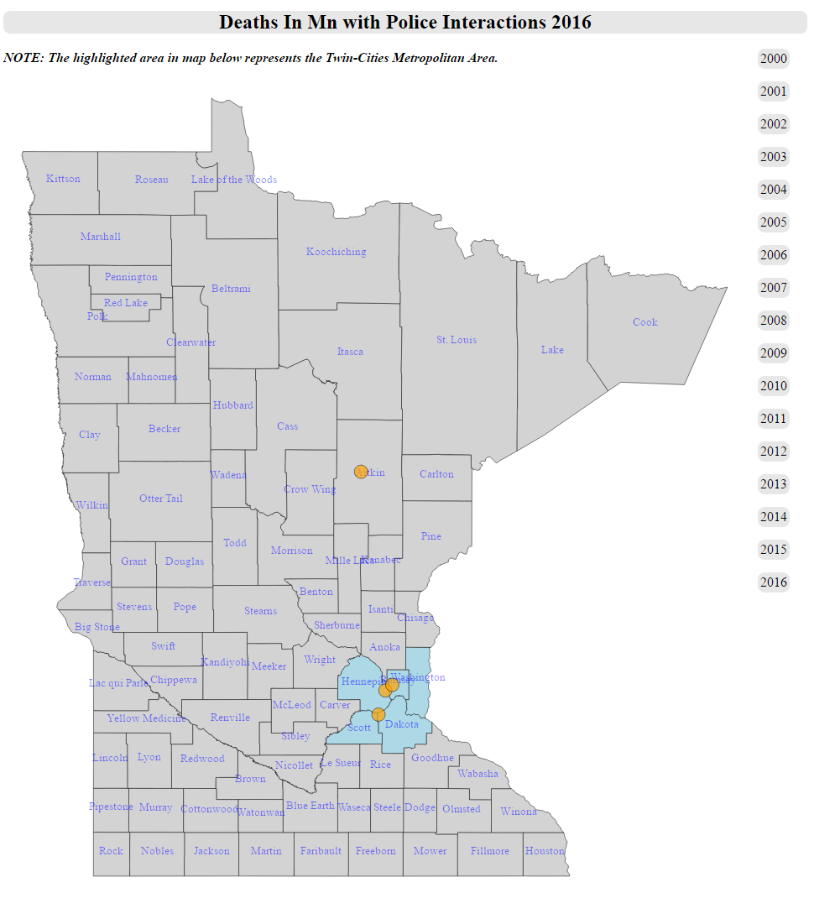
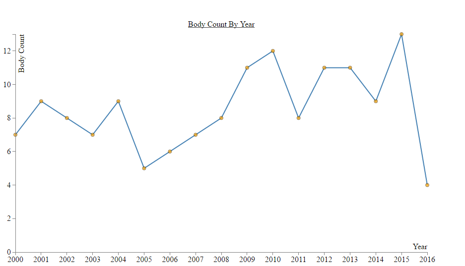

<h3>
Finding and Exploring the Data
</h3>
I was inspired by a blog I read on
<a href="http://fivethirtyeight.com/features/where-police-have-killed-americans-in-2015/">the
538 site</a> about police killings. I decided I would like to apply some
analysis on the same type of data however, just for my home state of
Minnesota. The first step was to find the data. This was much harder
than I thought, but finally I ran into the
<a href="http://www.startribune.com/database-of-deaths-after-police-use-of-force-in-minnesota-since-2000/350729601/">Star
Tribune article</a> about just such information. But where did they get
the data and how can I get it? I hunted for this data, later to find out
that on this very site, at the bottom close to a graph and a bit obscure
is a small icon that says, <i>"download the data"</i>. It was almost as
if they didn't want you to see it.   This data was not a big
dataset, only 145 rows and therefore it was easy to cleanse using Excel.
Most of the links for photos were broken and despite the cleansing, a
large number of photos still remained unavailable. My goal was to simply
show the number of deaths per year over time on a geoJson map of
Minnesota. I wanted to show two things. The first was that there is a
gentle increase in these incidences over time. The second was that the
majority of the incidents are in the Twin-Cities metro area, which is comprised of Hennepin, Ramsey and Washington counties. I also
included a table of the individuals that perished at the hands of the
police. I wanted to tell the story of the individuals as well as the
trend and clustering.   I did simple and obvious <i> search and
replace </i> fixes in Excel and then loaded the tsv into R for some
glances at the data. I wanted to glance at the following curiosities:
<ol>
<li>
A summary of the age of those killed
</li>
<li>
A table and a proportion of those killed by race
</li>
<li>
A table and a proportion of the weapons wielded by the victims
</li>
<li>
A table and a proportion of the classification of death
</li>
<li>
A table and a proportion of the cities in which the victim was killed
</li>
<li>
A table and a proportion of whether the officer was charged
</li>
<li>
A table and a proportion of the gender of the victim
</li>
<li>
A table and a proportion of how exactly the victim died
</li>
</ol>
    mn_shoot <- read.csv('c:/GMF/UdacityVisualizations/Project/mn_shootings2.tsv', header = TRUE, sep = '\t', stringsAsFactors = FALSE)

    mn_shoot$Gender <- gsub(" ", "", mn_shoot$Gender)

    mn_shoot$DeathDate <- as.Date(mn_shoot$DeathDate, "%m/%d/%Y")
    mn_shoot$BirthDate <- as.Date(mn_shoot$BirthDate, "%m/%d/%Y")
    mn_shoot$InjuryDate <- as.Date(mn_shoot$InjuryDate, "%m/%d/%Y")

    summary(mn_shoot$AgeYears)

    ##    Min. 1st Qu.  Median    Mean 3rd Qu.    Max. 
    ##   15.00   26.00   33.00   36.37   46.00   83.00

    table(mn_shoot$Race)

    ## 
    ## AMERICAN INDIAN           ASIAN           BLACK      OTHER RACE 
    ##               9               8              40               1 
    ##    RACE UNKNOWN           WHITE 
    ##               4              83

    prop.table(table(mn_shoot$Race))

    ## 
    ## AMERICAN INDIAN           ASIAN           BLACK      OTHER RACE 
    ##     0.062068966     0.055172414     0.275862069     0.006896552 
    ##    RACE UNKNOWN           WHITE 
    ##     0.027586207     0.572413793

    table(mn_shoot$Weapon)

    ## 
    ## .22-CALIBER RUGER SEMIAUTOMATIC,UNLOADED 
    ##                                        1 
    ##                     .32-CALIBER REVOLVER 
    ##                                        1 
    ##                9MM SEMIAUTOMATIC HANDGUN 
    ##                                        1 
    ##                           AIRSOFT PISTOL 
    ##                                        1 
    ##               ASSAULT RIFLE AND HANDGUNS 
    ##                                        1 
    ##                             BASEBALL BAT 
    ##                                        1 
    ##                                   BB GUN 
    ##                                        2 
    ##              BROKEN GLASS AND METAL POLE 
    ##                                        1 
    ##         BURNING FABRIC, OFFICER'S WEAPON 
    ##                                        1 
    ##                                  CROWBAR 
    ##                                        1 
    ##                          GOLF CLUB SHAFT 
    ##                                        1 
    ##                                      GUN 
    ##                                       22 
    ##                                     GUNS 
    ##                                        1 
    ##                                  HANDGUN 
    ##                                        9 
    ##            HEAVY OBJECT WRAPPED IN CLOTH 
    ##                                        1 
    ##                                    KNIFE 
    ##                                       14 
    ##                       KNIFE AND SCISSORS 
    ##                                        1 
    ##                   KNIFE MISTAKEN FOR GUN 
    ##                                        1 
    ##                           KNIFE, VEHICLE 
    ##                                        1 
    ##                                   KNIVES 
    ##                                        3 
    ##                      MACHETE AND CROWBAR 
    ##                                        1 
    ##                                METAL BAT 
    ##                                        1 
    ##                               METAL POLE 
    ##                                        1 
    ##                               PELLET GUN 
    ##                                        2 
    ##                        PEN AND CLIPBOARD 
    ##                                        1 
    ##                                 REVOLVER 
    ##                                        1 
    ##                         REVOLVER (EMPTY) 
    ##                                        1 
    ##                                    RIFLE 
    ##                                        7 
    ##                         RIFLE OR SHOTGUN 
    ##                                        1 
    ##                 RUGER .22 SEMI AUTOMATIC 
    ##                                        1 
    ##                             SCREW DRIVER 
    ##                                        1 
    ##                    SEMIAUTOMATIC HANDGUN 
    ##                                        1 
    ##                                  SHOTGUN 
    ##                                        6 
    ##                 SHOTGUN AND COMPOUND BOW 
    ##                                        1 
    ##                        SHOTGUN AND RIFLE 
    ##                                        1 
    ##                                    SWORD 
    ##                                        1 
    ##                             TWO HANDGUNS 
    ##                                        1 
    ##                                  UNARMED 
    ##                                       11 
    ##                      UNIDENTIFIED WEAPON 
    ##                                        1 
    ##                                  UNKNOWN 
    ##                                       26 
    ##                                  VEHICLE 
    ##                                        9 
    ##                 VEHICLE, DRAGGED OFFICER 
    ##                                        2 
    ##                 VEHICLE, GUN FOUND LATER 
    ##                                        1 
    ##   VEHICLE, LATER FOUND LOADED GUN IN CAR 
    ##                                        1

    prop.table(table(mn_shoot$Weapon))

    ## 
    ## .22-CALIBER RUGER SEMIAUTOMATIC,UNLOADED 
    ##                              0.006896552 
    ##                     .32-CALIBER REVOLVER 
    ##                              0.006896552 
    ##                9MM SEMIAUTOMATIC HANDGUN 
    ##                              0.006896552 
    ##                           AIRSOFT PISTOL 
    ##                              0.006896552 
    ##               ASSAULT RIFLE AND HANDGUNS 
    ##                              0.006896552 
    ##                             BASEBALL BAT 
    ##                              0.006896552 
    ##                                   BB GUN 
    ##                              0.013793103 
    ##              BROKEN GLASS AND METAL POLE 
    ##                              0.006896552 
    ##         BURNING FABRIC, OFFICER'S WEAPON 
    ##                              0.006896552 
    ##                                  CROWBAR 
    ##                              0.006896552 
    ##                          GOLF CLUB SHAFT 
    ##                              0.006896552 
    ##                                      GUN 
    ##                              0.151724138 
    ##                                     GUNS 
    ##                              0.006896552 
    ##                                  HANDGUN 
    ##                              0.062068966 
    ##            HEAVY OBJECT WRAPPED IN CLOTH 
    ##                              0.006896552 
    ##                                    KNIFE 
    ##                              0.096551724 
    ##                       KNIFE AND SCISSORS 
    ##                              0.006896552 
    ##                   KNIFE MISTAKEN FOR GUN 
    ##                              0.006896552 
    ##                           KNIFE, VEHICLE 
    ##                              0.006896552 
    ##                                   KNIVES 
    ##                              0.020689655 
    ##                      MACHETE AND CROWBAR 
    ##                              0.006896552 
    ##                                METAL BAT 
    ##                              0.006896552 
    ##                               METAL POLE 
    ##                              0.006896552 
    ##                               PELLET GUN 
    ##                              0.013793103 
    ##                        PEN AND CLIPBOARD 
    ##                              0.006896552 
    ##                                 REVOLVER 
    ##                              0.006896552 
    ##                         REVOLVER (EMPTY) 
    ##                              0.006896552 
    ##                                    RIFLE 
    ##                              0.048275862 
    ##                         RIFLE OR SHOTGUN 
    ##                              0.006896552 
    ##                 RUGER .22 SEMI AUTOMATIC 
    ##                              0.006896552 
    ##                             SCREW DRIVER 
    ##                              0.006896552 
    ##                    SEMIAUTOMATIC HANDGUN 
    ##                              0.006896552 
    ##                                  SHOTGUN 
    ##                              0.041379310 
    ##                 SHOTGUN AND COMPOUND BOW 
    ##                              0.006896552 
    ##                        SHOTGUN AND RIFLE 
    ##                              0.006896552 
    ##                                    SWORD 
    ##                              0.006896552 
    ##                             TWO HANDGUNS 
    ##                              0.006896552 
    ##                                  UNARMED 
    ##                              0.075862069 
    ##                      UNIDENTIFIED WEAPON 
    ##                              0.006896552 
    ##                                  UNKNOWN 
    ##                              0.179310345 
    ##                                  VEHICLE 
    ##                              0.062068966 
    ##                 VEHICLE, DRAGGED OFFICER 
    ##                              0.013793103 
    ##                 VEHICLE, GUN FOUND LATER 
    ##                              0.006896552 
    ##   VEHICLE, LATER FOUND LOADED GUN IN CAR 
    ##                              0.006896552

    table(mn_shoot$MannerDeath)

    ## 
    ##                ACCIDENT COULD NOT BE DETERMINED                HOMICIDE 
    ##                       5                       4                     129 
    ##                 NATURAL           NOT AVAILABLE                 SUICIDE 
    ##                       2                       4                       1

    prop.table(table(mn_shoot$MannerDeath))

    ## 
    ##                ACCIDENT COULD NOT BE DETERMINED                HOMICIDE 
    ##             0.034482759             0.027586207             0.889655172 
    ##                 NATURAL           NOT AVAILABLE                 SUICIDE 
    ##             0.013793103             0.027586207             0.006896552

    table(mn_shoot$InjuryCity)

    ## 
    ##               ANDOVER          APPLE VALLEY              BEAUFORD 
    ##                     1                     1                     1 
    ##               BEMIDJI     BIG LAKE TOWNSHIP             BLACKDUCK 
    ##                     2                     1                     1 
    ##           BLOOMINGTON       BROOKLYN CENTER         BROOKLYN PARK 
    ##                     2                     3                     2 
    ##            BURNSVILLE                CHASKA              COHASSET 
    ##                     1                     1                     1 
    ##      COLUMBIA HEIGHTS     COLUMBUS TOWNSHIP         COTTAGE GROVE 
    ##                     1                     1                     2 
    ##          DODGE CENTER                DULUTH          EDEN PRAIRIE 
    ##                     1                     5                     3 
    ##                 EDINA             ELK RIVER               EVELETH 
    ##                     2                     1                     1 
    ##            FARMINGTON          FERGUS FALLS               FLEMING 
    ##                     1                     1                     1 
    ##           FORT RIPLEY               FRIDLEY         GOLDEN VALLEY 
    ##                     1                     2                     1 
    ##              HAM LAKE              HASTINGS            HERMANTOWN 
    ##                     1                     1                     1 
    ##            HUTCHINSON       KASOTA TOWNSHIP          LITTLE FALLS 
    ##                     1                     1                     2 
    ##              MAHNOMEN               MANKATO             MAPLEWOOD 
    ##                     1                     3                     1 
    ##           MINNEAPOLIS        MINNESOTA CITY            MINNETONKA 
    ##                    28                     1                     2 
    ##                  MORA         MOUNTAIN IRON          NEW BRIGHTON 
    ##                     1                     1                     1 
    ##              NEW HOPE          NORTH BRANCH NORTH BRANCH TOWNSHIP 
    ##                     2                     1                     1 
    ##         NORTH MANKATO         NORTH ST PAUL                 ORONO 
    ##                     1                     1                     1 
    ##       OSAKIS TOWNSHIP              PLYMOUTH             PRINCETON 
    ##                     1                     1                     1 
    ##                RAMSEY              RED LAKE             RICHFIELD 
    ##                     1                     2                     1 
    ##             ROCHESTER             ROSEMOUNT             ROSEVILLE 
    ##                     2                     1                     2 
    ##              SHAKOPEE             SHOREVIEW            ST ANTHONY 
    ##                     2                     1                     1 
    ##         ST LOUIS PARK               ST PAUL          STEWARTVILLE 
    ##                     2                    22                     1 
    ##            STILLWATER                WADENA          WEST ST PAUL 
    ##                     3                     1                     1 
    ##              WOODBURY              ZUMBROTA 
    ##                     4                     1

    prop.table(table(mn_shoot$InjuryCity))

    ## 
    ##               ANDOVER          APPLE VALLEY              BEAUFORD 
    ##           0.006896552           0.006896552           0.006896552 
    ##               BEMIDJI     BIG LAKE TOWNSHIP             BLACKDUCK 
    ##           0.013793103           0.006896552           0.006896552 
    ##           BLOOMINGTON       BROOKLYN CENTER         BROOKLYN PARK 
    ##           0.013793103           0.020689655           0.013793103 
    ##            BURNSVILLE                CHASKA              COHASSET 
    ##           0.006896552           0.006896552           0.006896552 
    ##      COLUMBIA HEIGHTS     COLUMBUS TOWNSHIP         COTTAGE GROVE 
    ##           0.006896552           0.006896552           0.013793103 
    ##          DODGE CENTER                DULUTH          EDEN PRAIRIE 
    ##           0.006896552           0.034482759           0.020689655 
    ##                 EDINA             ELK RIVER               EVELETH 
    ##           0.013793103           0.006896552           0.006896552 
    ##            FARMINGTON          FERGUS FALLS               FLEMING 
    ##           0.006896552           0.006896552           0.006896552 
    ##           FORT RIPLEY               FRIDLEY         GOLDEN VALLEY 
    ##           0.006896552           0.013793103           0.006896552 
    ##              HAM LAKE              HASTINGS            HERMANTOWN 
    ##           0.006896552           0.006896552           0.006896552 
    ##            HUTCHINSON       KASOTA TOWNSHIP          LITTLE FALLS 
    ##           0.006896552           0.006896552           0.013793103 
    ##              MAHNOMEN               MANKATO             MAPLEWOOD 
    ##           0.006896552           0.020689655           0.006896552 
    ##           MINNEAPOLIS        MINNESOTA CITY            MINNETONKA 
    ##           0.193103448           0.006896552           0.013793103 
    ##                  MORA         MOUNTAIN IRON          NEW BRIGHTON 
    ##           0.006896552           0.006896552           0.006896552 
    ##              NEW HOPE          NORTH BRANCH NORTH BRANCH TOWNSHIP 
    ##           0.013793103           0.006896552           0.006896552 
    ##         NORTH MANKATO         NORTH ST PAUL                 ORONO 
    ##           0.006896552           0.006896552           0.006896552 
    ##       OSAKIS TOWNSHIP              PLYMOUTH             PRINCETON 
    ##           0.006896552           0.006896552           0.006896552 
    ##                RAMSEY              RED LAKE             RICHFIELD 
    ##           0.006896552           0.013793103           0.006896552 
    ##             ROCHESTER             ROSEMOUNT             ROSEVILLE 
    ##           0.013793103           0.006896552           0.013793103 
    ##              SHAKOPEE             SHOREVIEW            ST ANTHONY 
    ##           0.013793103           0.006896552           0.006896552 
    ##         ST LOUIS PARK               ST PAUL          STEWARTVILLE 
    ##           0.013793103           0.151724138           0.006896552 
    ##            STILLWATER                WADENA          WEST ST PAUL 
    ##           0.020689655           0.006896552           0.006896552 
    ##              WOODBURY              ZUMBROTA 
    ##           0.027586207           0.006896552

    table(mn_shoot$Officer.charged.)

    ## 
    ##            NO CHARGES 
    ##         11        134

    prop.table(table(mn_shoot$Officer.charged.))

    ## 
    ##            NO CHARGES 
    ## 0.07586207 0.92413793

    table(mn_shoot$Gender)

    ## 
    ## FEMALE   MALE 
    ##      6    139

    prop.table(table(mn_shoot$Gender))

    ## 
    ##     FEMALE       MALE 
    ## 0.04137931 0.95862069

    table(mn_shoot$SubCategory)

    ## 
    ##   ACCIDENT RESTRAINED       SHOT      TASED 
    ##          1          7        127         10

    prop.table(table(mn_shoot$SubCategory))

    ## 
    ##    ACCIDENT  RESTRAINED        SHOT       TASED 
    ## 0.006896552 0.048275862 0.875862069 0.068965517

Not a lot can be done with the weapon the victim was weilding. This data
would need some cleansing as a variety of terms for gun are used. The
goal of the visualization does not need this so I've set it aside for
later.   We see some expected things, such as a clustering of deaths
around the major metropolitan areas of Minneapolis and St. Paul, a much
greater percentage of men and a much higher number of white men (MN is
predominantly white).   However, I did notice a couple of suprising
things. The first was that a knife was the second most commonly weilded
weapon by a victim. Does a knife weilding individual need to be shot?
The second was that more than over 92% of the officers were not charged
for the incident. The third was that more than 12% of the victims died
from a police taser, use of restraint or an accident during the police
encounter.  I thought it would be useful to see a boxplot of the
age.

<!-- -->
 My curiosity is piqued for the two outliers!   I tried three
simple plots: the first to see a general trend, the second to see if
there is any trend when broken down by race and the third a histogram to
see if there is a seasonal element to the violence.

    mn_shoot_sub <- as.data.frame(format(mn_shoot$DeathDate, "%Y"))
    colnames(mn_shoot_sub)[1] <- 'year'
    mn_shoot_sub$count <- mn_shoot$count
    mn_shoot_agg <- aggregate(mn_shoot_sub$count, by = list(mn_shoot_sub$year), FUN = sum)
    mn_shoot_agg$Group.1 <- as.Date(mn_shoot_agg$Group.1, "%Y")
    #Also split out the race
    mn_shoot_sub$race <- mn_shoot$Race
    mn_shoot_rag <- aggregate(mn_shoot_sub$count, by = list(mn_shoot_sub$year, mn_shoot_sub$race), FUN = sum)
    mn_shoot_rag$Group.1 <- as.Date(mn_shoot_rag$Group.1, "%Y")

    ggplot(mn_shoot_agg, aes(Group.1, x)) +
      geom_line() + 
      scale_x_date(date_labels = "%Y")

<!-- -->

    ggplot(mn_shoot_rag, aes(Group.1, x, color = Group.2)) +
      geom_line() + 
      scale_x_date(date_labels = "%Y")

<!-- -->

    #seasonal trends?
    mn_shoot_sub$month <- format(mn_shoot$DeathDate, "%m")
    mn_shoot_month <- aggregate(mn_shoot_sub$count, by=list(mn_shoot_sub$year, mn_shoot_sub$month), FUN = sum)
    mn_shoot_month$x <- as.numeric(mn_shoot_month$x)
    mn_shoot_month$Group.2 <- as.numeric(mn_shoot_month$Group.2)
    hist(mn_shoot_month$Group.2)

<!-- -->
 The first plot shows a general trend upward in police related
deaths. However, this is gentle and could be due to <i>awareness</i> as
our data goes back to the dark ages of 2000. The decline in 2016 is for
the obvious reason that we are in early 2016. The second plot broken out
by race shows nothing worthwhile. The third histogram shows a spike in
July which corresponds to the theory that violence increases as the
temperature does. The smaller spike in April would coincide with Spring
and perhaps the winter blahs coming to an end. The higher number in
January is a bit of a mystery. Could it be new year's related? Could it
be post holiday blues?  

Back to the original plan. I believe, in the end, seeing the faces that
perished would be a powerful visualization. Of course, there is much
room for improvement. I will add a section to document what I will
continue to improve as my js and d3 skills advance.  

<h3>
Design
</h3>
My goal was to show clustering for a geographical area and a trend. I also wanted to have a 'martini' glass visualization. One that would tell a small story without user interaction and then allow the user to explore the data on their own. I felt that the subject matter was a bit sensitive, therefore I did not want to leave any police related death in MN be left out. This is why I chose a map of Minnesota as my geoJSON instead of just the metropolitan area. The challenge I had was telling a story to individuals who were unfamiliar with MN what the clustering of deaths meant. I wasn't sure how to do this, and was unable until after my first submission. The recommendation from the reviewer was to use a map of the Metropolitan area. I think that was great feedback, but I didn't want to leave out police related deaths in other parts of the state. I turned to a geoJSON that had the counties on it. I highlighted the counties that are associated with the Twin-Cities Metropolitan area and put a note above the map that says <i>"NOTE: the highlighted area in the map below represents the Twin Cities Metropolitan Area."</i> This way one can easily see the majority of the deaths occur in the highlighted area. I also wanted it at the top because the story has more meaning when you initially know what the highlighted area represents.  
The next challenge was to show that the trend of police related deaths in MN has been increasing. This is not easily done on a geoJson unless there is a strong increase. In my case, the upward trend is gentle. Therefore, I went with a simple small scatter-line chart of the number of deaths per year. One can see clearly that overall the trend is upward, with the exception of 2016 which is easily explained as we are only in the beginning of this year.  
The final challenge is to give personality to the visualization. I wanted to tell each person's unique story of how they died. This was most easily accomplished by adding a table at the bottom of the previous two visualizations. The user cannot see the scatter-line chart or the table until after the martini-glass story has completed. Once completed, they are free to read the stories and see the faces of those who died. Some of the stories of death at the hands of police are disturbing, especially when it relates to those with mental illness. Sadly, this appears to be the majority...despite the death of Barbara Schneider in 2000 and the subsequent founding of the Barbara Schneider Foundation to provide officers with mental health training. <i>This is one component of the story I didn't expect to see until after exploring the visualizations.</i>

<h3>
Sources
</h3>
I relied very heavily upon the Udacity course on Data Visualization as
can be seen by the code. I also, as usual, found advice in Stack
Overflow. Furthermore, Mike Bostock's work was fundamental and I found
infinite tips and advice in his<a href="https://bost.ocks.org/mike/">
blogs</a>.  

<h3>
Data Visualization
</h3>
I started with dimple.js to do the visualization but it became quickly
apparent that it was not enough for what I wanted to do. I turned to d3
because of its ease of use and the plethora resources online to get me
through my first d3 visualization.  
<h3>
The Plan
</h3>
My goal was to create a martini glass storyline where I showed the
number of police related deaths by year on a map of Minnesota. When the
story completed, I wanted the user to be able to click on a button for
the year to show the deaths related to that year. Furthermore, I wanted
to have a mouse-over effect to show a pop-up of the details of the
individual who died. I was not able to accomplish the last step so I
resorted to a table of details below the map. I intend to continue to
research how to do this.  
<h3>
Feedback
</h3>
I gathered feedback from a number of people. I will detail only three.
 
<ol>
<li>
I made the mistake of asking a web designer. He focused on the color
aesthetics and felt the coloring was not 'pleasing to the eye.' He also
did not like the choppy transitions. I smoothed some of the button
lines, changed the colors, added transitions and returned to him. He
felt it had improved, but said I needed a color pallet and a thematic
design. At this point, I felt he was being a bit too 'designy'.
</li>
<li>
The next person loved how the timeline progressed and asked why the dots
'clustered' in a certain spot. Well, that was Minneapolis and St. Paul
where most of the police actions took place. They felt it would be an
improvement to put counties and geographical markers on the map. I tried
to find, without much luck, geoJson files that would suit my need. Most
of them revolved around campaign areas and census statistics. Then I ran
into <a href="http://kartograph.org/showcase/italia/">this FANTASTIC
visualization</a> and said, "heck yea, this is what I want!" and
realized my skills were not at that level. I was not able to accommodate
this user's request to add more data to the map itself, but intend to
continue at it. The kartograph map was truly an inspiration.
</li>
<li>
The third user wanted a pop-up over the circles to show the details of
the person who died. I spent many hours trying to accommodate this feat,
without success.
</li>
</ol>
 

<h3>
Post feedback design changes
</h3>
The only design changes I was able to implement were in the areas of
aesthetics. Color, transition, duration of transition, speed of the
timeline and etc. were not that difficult. Applying more geographical
information doing dynamic pop-ups was something I was unable to
accomplish at this time and I do not think I would be able to before the
project deadline.  
Following my first submission I added counties to the map, highlighted the Metropolitan Area, added a scatter-line chart to show the increasing trend of police related deaths and did some general aesthetic improvements.  

<h3>
Submissions
</h3>
There are ten essential files here.
<ol>
<li>
d3.min.js
</li>
<li>
index.html
</li>
<li>
index1.html
</li>
<li>
style.css
</li>
<li>
script.js
</li>
<li>
style1.css
</li>
<li>
script1.js
</li>
<li>
mn_shootings.tsv
</li>
<li>
yeardeaths.tsv
<li>
mn.json
</li>
</ol>
Index.html is the submission html. Index1.html is the pop-up work I did
to show those individuals who died in police related incidents and is
also a fair visualization. The obvious problem with index1 is that it
includes all deaths (145) for all years and is too cluttered. It was my
intent to integrate the two, but was unable to do so. However, I think
the first chart, showing deaths in MN over time and then showing a table
at the bottom of those individuals is worthwhile. Seeing the faces of
the dead and reading the stories is a bit addictive. I read every one,
some I remember from the news.  

<h3>
Next Steps
</h3>
I'm inspired by <a href="http://kartograph.org/showcase/italia/">this
kartograph</a> and would like to make a map as beautiful as that. I'd
like to create a visualization someone would explore with natural
curiosity. I do not feel my visualization has that quality to its
fullest potential. I would also like to include a line chart by race of
deaths as a proportion of population to accompany the geoJson. These are
interesting, and potentially powerful, visualizations that perhaps I
could give back to
<a href="http://www.startribune.com/database-of-deaths-after-police-use-of-force-in-minnesota-since-2000/350729601/">the
Star Tribune</a>. After all, as rudimentary as my visualization is now,
I feel it is better than what they have. Furthermore, take a look at
their site and charts. I feel the bar-charts they provide area actually
misleading. A bar chart is not the best visualization for showing trends
over time; a line chart would have been more effective. Also, the
disproportionate minority deaths as a side by side bar chart leads one
to first assume that an alarmingly high percentage of the population is
being killed by police. Would not a
<a href="http://vizwiz.blogspot.com/2013/01/alberto-cairo-three-steps-to-become.html">slope
chart</a> be ideal here?

<h3>
Static Screen Grabs of Visualization before First Submission
</h3>
 
<h3>
Static Screen Grabs of the Final Visualization
 

</h3>
